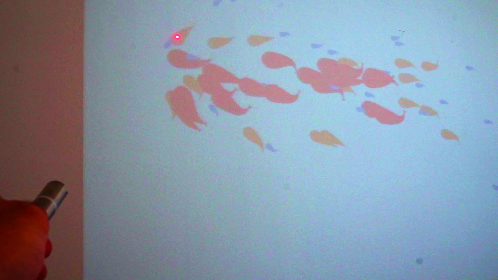

# 🐟 Fish-Pond-AR
A visual demo of a fish pond with responsive movement.

Using a projector and a laser you can play in the fish pond!

Here is a video with the results: https://www.linkedin.com/posts/diego-bonilla-salvador_python-imageprocessing-opencv-activity-6949034681333899264-LiZO?utm_source=share&utm_medium=member_desktop
